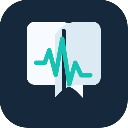

# Notetaker App

## First public Windows build

Notetaker turns a recorded lecture into timestamped transcription and detailed, source-linked study notes. This first public build is a browser-free native Windows application. Download the installer or portable ZIP from the [latest GitHub release](https://github.com/akulusprimerift/Notetaker-App/releases/latest).

### Install and start

1. On Windows 10 22H2 or Windows 11 x64, download `Notetaker-Native-0.3.1-Setup.exe` and run it. Windows may show an unsigned-app warning; choose the option to continue only if you downloaded the file from this repository's release page.
2. Open Notetaker from the Start menu. The app creates a private local library automatically; no account, access key, Docker, Python, browser, Ollama or internet connection is required.
3. Open **Local models** and select a local note model, or import a compatible local Qwen GGUF. Note models are not included in the download and are never downloaded by the app.
4. Create a course and lecture, optionally add syllabus or text-based lecture materials, choose the recording input, and press **Record**.
5. Press **Stop and save** when the lecture ends. Live transcript and note previews appear as processing catches up; saved note sections remain available even if a later generation attempt fails.
6. Review the transcript and notes, make any edits, and export the selected saved revision.

For recovery, backup, model setup, supported materials, storage location and known limitations, see [Windows download and usage](docs/native-download.md). The portable ZIP is useful when you do not want an installer; keep its `_internal` folder and `NotetakerService.exe` beside `Notetaker.exe`.

This release is unsigned and has been verified with synthetic audio and an isolated Windows 11 install. Real-device recording, accessibility, long-duration endurance, coordinated backup/restore, upgrade testing and human note-quality review remain release follow-ups. macOS is planned separately and is not part of this build.

Current work: course materials were brought forward from Phase 7.2 by the user before Phase 6.8. PPTX, DOCX, TXT and Markdown uploads now pin source text into streamed, protected note regeneration. See [materials evidence](docs/implementation/course-materials.md). The user has selected a browser-free native Windows rebuild. Qt Widgets, bundled local services and standalone storage now replace Electron for the Windows deliverable; verification is active. Earlier qualification gaps remain open.

A Windows lecture note-taking application for any course or subject, focused on turning dense, content-heavy lectures into detailed, organized, trustworthy notes.

The current product priority is **reliable lecture capture → timestamped transcription → high-quality, source-linked notes**. Notes should preserve definitions, explanations, worked examples, reasoning, qualifications, and professor emphasis. A short summary is an optional companion to the detailed notes.

## Native Windows download

See [download and model setup](docs/native-download.md). The native package runs without Docker, Python, PowerShell, Ollama or a browser installed separately. Version 0.3.1 includes an English faster-whisper speech model, as requested by the user; note model weights remain selected local files. Inference never downloads models. Recording has input selection, a level meter and separate capture/save counters; live transcript and note previews share the study workspace. Completed note sections are saved and appended during recording once enough transcript context is available. Individual lectures can be deleted. The standalone library does not automatically import the earlier Docker library. GitHub Actions builds the downloadable ZIP and installer on native version tags.

## Current phase

Follow the [feature and architecture phase plan](docs/project-phases.md) for all future work: Phase 6.1–6.8 maps to M01–M08, with features, architecture changes, completion evidence and local commits for every increment.

**Phase 6.8 / M08: Windows application.** The native Qt Widgets application bundles its Python and CPU inference runtimes, uses an explicit standalone library and detects local model locations. The earlier Electron/Docker workspace remains a separate development option. M07 behavior is retained: Save immutable final lecture snapshots with incomplete results visible, retain revision history, recover late audio into a new snapshot, remove audio or delete a lecture with progress and browser-copy cleanup. Saved prompt profiles reuse your instructions across lectures, and the local workspace opens without an access key. Human quality review, full-lecture hardware qualification and release qualification remain open.

- [Finalization and data control / M07](docs/implementation/phase-6-m07.md): snapshot history, late recovery, deletion reconciliation and browser purge.
- [Working instructions](AGENTS.md) and [session transfer](SESSION_TRANSFER.md): product intent, workflow, Bun/uv commands and the latest handoff.
- [Editing, streaming and regeneration / M06](docs/implementation/phase-6-m06.md): live improvements, protected revisions, comparison, undo and verification boundaries.
- [Live assistance / M05](docs/implementation/phase-6-m05.md): original live implementation and its historical evidence; M06 supersedes its timing and resource policy.
- [Windows desktop direction](docs/architecture/windows-desktop-direction.md): proposed early desktop host and remaining installer work.
- [Automatic notes / M04](docs/implementation/phase-6-m04.md): model selection, automatic generation, source inspection, export, limitations and later OpenAI/Claude connections.
- [Run the app and review M01 results](docs/implementation/phase-6-m01.md): local startup, implemented behavior, executed checks and remaining milestones.
- [Transcription and source inspection / M03](docs/implementation/phase-6-m03.md): speech setup, synthetic accuracy results, source playback, correction protection and remaining qualification.
- [Recording and recovery / M02](docs/implementation/phase-6-m02.md): current behavior, synthetic test evidence, failure handling and remaining qualification.

With Docker Desktop's Linux engine running, provision speech once with `pwsh -File scripts/Provision-Speech.ps1`, then run `pwsh -File scripts/Start-App.ps1 -WithSpeech` and open `http://127.0.0.1:3000`. The local workspace opens automatically; no access key is needed. Existing courses and sessions are preserved. Saved prompt profiles reuse your detail, layout and writing instructions across lectures.

- [Current product and technical specification](multimodal_academic_learning_system_spec.md): consolidated scope, selected architecture, evidence boundaries and release gates.
- [Current architecture artifact](multimodal_academic_learning_system_architecture_v2.html): standalone visual overview, version 0.4; the existing filename is retained.
- [Phase 5 implementation roadmap](docs/implementation/phase-5-roadmap.md): M01–M08, dependencies, migration/interface sequence, all 32 acceptance cases and six open qualification gates.
- [Phase 5 reconciliation](docs/implementation/phase-5-reconciliation.md): decisions changed from the originals and unresolved evaluation work.
- [Phase 5 verification](docs/implementation/phase-5-verification.md): checks performed on the consolidated documents and artifact.

The active implementation phase is **Phase 6.8 / M08**. See [Windows application](docs/implementation/phase-6-m08.md). M06 protected editing and live improvements are retained. M07 adds finalization/data controls; it does not close outstanding microphone, human-review, sustained-performance or Windows delivery gates. OpenAI/Claude connections remain in Phase 7. Earlier design records follow:

- [Phase 1 product brief](docs/product/phase-1-product-brief.md): audience, first-release scope, note requirements, quality gates, and open decisions.
- [Phase 2 student experience](docs/product/phase-2-student-experience.md): screens, lecture workflows, recording states, source inspection, editing, export, and accessibility requirements.
- [Phase 2 acceptance scenarios](docs/product/phase-2-acceptance-scenarios.md): observable outcomes and coverage of every core Phase 1 requirement.
- [Phase 2 verification](docs/product/phase-2-verification.md): documentation checks and the boundary between reviewed requirements and future application tests.
- [Phase 3 architecture](docs/architecture/phase-3-architecture.md): chosen components, capture recovery, processing, revisions, privacy, and deployment boundaries.
- [Phase 3 data model](docs/architecture/phase-3-data-model.md): entities, relationships, constraints, and transaction boundaries.
- [Phase 3 API and events](docs/architecture/phase-3-api-events.md): write, replay, retry, and synchronization contracts.
- [Phase 3 verification](docs/architecture/phase-3-verification.md): scenario traceability, reference tests, and remaining integration work.
- [Phase 4 AI pipeline](docs/ai/phase-4-pipeline.md): speech/note settings, evidence boundaries, context handling, and provider contracts.
- [Phase 4 evaluation plan](docs/ai/phase-4-evaluation.md): fixtures, scoring, review requirements, and qualification gates.
- [Phase 4 results](docs/ai/phase-4-results.md): executed checks, local model trials, and outstanding validation.
- [Project phases](docs/project-phases.md): the sequence from product definition through implementation and expansion.

The consolidated specification controls current scope. Earlier phase documents retain detailed contracts and the history of design/evaluation decisions.

## Original design references

- [Archived v0.2 specification](docs/archive/original-spec-v0.2.md)
- [Archived v0.2 architecture artifact](docs/archive/original-architecture-v0.2.html)

Practice generation, mastery tracking, personalization, and advanced infrastructure demonstrations follow validation of the core note-taking experience.

## Documentation verification

Use **Bun and uv**. Install JavaScript dependencies with `bun install --frozen-lockfile --ignore-scripts`. Install pinned backend/test dependencies with `uv pip install --python .venv/Scripts/python.exe --require-hashes -r apps/api/requirements-dev.lock` after creating the Python environment. Run `bun run test`, `bun run lint`, `bun run typecheck`, `bun run build:web`, `bun run verify:docs`, `uv run --no-project ruff check apps/api`, and `uv run --no-project python -m pytest -q` with `PYTHONPATH=apps/api`. Default backend tests use isolated SQLite databases; `scripts/Test-Services.ps1` runs PostgreSQL tests in temporary schemas. Run `git diff --check` before committing. See M06 and the session transfer for browser tests and Windows tooling details.

With Qwen3 4B already installed in a local Ollama service, run `bun run eval:notes -- qwen3:4b` for the three synthetic CS cases. This command contacts only the loopback Ollama endpoint, never downloads a model, and writes results under the ignored `evaluations/local-runs/` directory. Valid structure is not a passing educational-quality score. Selected reviewed run artifacts belong in `evaluations/reports/`; model weights and caches do not belong in Git.
