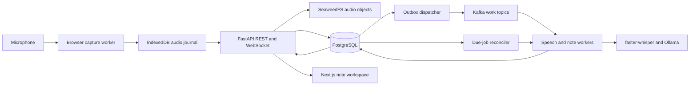

# Phase 3: Architecture baseline

Version: 0.1

Date: 2026-09-05

Status: Selected design for implementation; no services deployed, database migrated, or recording pipeline implemented.

This baseline implements the priorities in the [product brief](../product/phase-1-product-brief.md) and [student experience](../product/phase-2-student-experience.md). It supersedes conflicting first-release stack recommendations in the original source documents. Full editorial consolidation remains Phase 5.

## Selected decisions and tradeoffs

| Decision | Choice | Alternative and consequence |
| --- | --- | --- |
| Backend boundaries | One FastAPI application owns REST and WebSocket endpoints; one Python codebase also runs separate worker processes. | Separate API/realtime microservices would add coordination before scale is demonstrated. |
| Frontend | Next.js and TypeScript, with capture/persistence work outside the rendering loop. | Native desktop packaging may offer stronger OS integration but is outside the first browser release. |
| System of record | PostgreSQL for metadata, versions, job ledger, outbox, ownership, and deletion state. | Kafka and browser storage cannot replace authoritative transactional state. |
| Audio objects | SeaweedFS through a server-only S3 adapter, with persistent data and metadata volumes. | Local filesystem storage is simpler, but retaining the original object-storage choice supports a real upload/reconciliation workflow. A fake adapter is limited to tests. |
| Asynchronous execution | Kafka for durable work notification/replay; PostgreSQL job ledger for claims, retries, and recovery. | Direct in-request inference would tie capture to model latency. The ledger adds state but makes lost notifications and broker downtime recoverable. |
| State cache | No Valkey dependency in the initial deployment. | PostgreSQL and bounded process-local caches cover initial needs; add Valkey only after a measured hot path. |
| Speech and notes | faster-whisper speech adapter and Ollama note adapter. | Cloud adapters remain an extension, with no automatic external fallback. Model IDs and inference windows are selected in Phase 4. |
| Retrieval and vision | No embeddings, pgvector index, image worker, or document ingestion in the initial capture-to-notes path. | Retain relational source IDs suitable for later extensions; unavailable visuals remain explicit limitations. |
| Event contracts | Versioned JSON envelopes validated at boundaries initially. | Protobuf and Apicurio remain a later schema-evolution milestone; avoid maintaining both formats before consumers exist. |
| Operations | Docker Compose, structured logs, trace IDs, stage duration metrics, and a job-status view. | Full dashboards, Kubernetes, Strimzi, KEDA, and GitOps follow a working pipeline and measured experiments. |

## Component flow

Kafka carries references and lifecycle metadata, never audio, transcript text, note text, or prompts. The durable ledger and the broker have different roles; both notification paths must acquire the same job claim before inference.

## ARC-01: Runtime, admission, and recording ownership

Design target: one local user, a Windows 11 development host, Docker's WSL 2 Linux-container path, and a current stable desktop Chromium browser (Edge or Chrome). This is the intended test matrix, not a verified support claim. Pin exact dependency, container, and browser versions when implementation begins. [Docker documents the WSL backend](https://docs.docker.com/desktop/features/wsl/).

Hardware inspection was denied in this session; CPU, RAM, GPU, and VRAM remain unknown. Docker and Python were not found on this session's PATH; that does not prove they are absent elsewhere. Do not install or configure them as part of this documentation phase. The reference tests use the available Node.js v22.13.1.

Release configurations are **Fully Local** and **Record now, process later**. The latter is a processing schedule, not a separate privacy mode. Actual live-model capacity is unverified. No GPU or latency requirement is invented; Phase 4 must publish measured RAM/VRAM, real-time factor, contention, and finalization time for the chosen models.

Admission requires microphone permission, a functioning capture worker, a successful local journal write/read test, enough estimated buffer space, and an authenticated server-created capture run. A model outage permits capture-only mode. A newly opened app cannot create a new offline lecture while the server is unavailable; an already authorized run may continue journaling during an outage. This is a deliberate first-release limitation.

Hold a nonqueued exclusive Web Lock keyed by lecture ID while capturing; a second tab monitors instead of waiting to start automatically. Web Locks coordinate same-origin contexts, not different browser profiles or devices. [MDN Web Locks](https://developer.mozilla.org/en-US/docs/Web/API/Web_Locks_API)

PostgreSQL separately stores `capture_owner_id` and monotonically increasing `capture_epoch`. A heartbeat indicates liveness only; expiration does not silently grant a second owner. Explicit takeover locks the lecture row, advances the epoch, and creates a new run. Old-owner live writes are fenced. A disconnected old owner may still have physical local audio; it must stop on discovering the takeover, and recoverable fragments enter a separate recovery request, never a second active stream. Web Locks plus fencing do not promise remote control of an offline microphone.

## ARC-02: Capture, persistence, and honest save status

Use AudioWorklet to collect microphone samples, with a worker packaging independently decodable mono PCM16 WAV chunks, initially about two seconds each at the actual capture sample rate. The worker persists each blob and manifest entry in one IndexedDB transaction before uploading. AudioWorklet provides an audio-processing execution context and requires a secure context. [MDN AudioWorklet](https://developer.mozilla.org/en-US/docs/Web/API/AudioWorklet)

Transport chunks are not speech inference windows or topic boundaries. Backend STT may resample and combine overlapping context windows, preserving the original sample-to-time mapping. Native sample positions determine elapsed audio; wall-clock time helps expose sleep/disconnection gaps. Each resumed run has its own sample clock and explicit offset/uncertainty on the lecture timeline.

IndexedDB is a recovery journal, not an off-device backup or universal power-loss guarantee. Request persistent storage, record whether it was granted, and show the actual result. A browser can decline persistence. Completed transactions and sudden shutdown still require careful handling. [MDN IndexedDB](https://developer.mozilla.org/en-US/docs/Web/API/IndexedDB_API/Using_IndexedDB), [MDN persistent storage](https://developer.mozilla.org/en-US/docs/Web/API/StorageManager/persist)

Initial configurable limits: 1 GiB journal ceiling, 8 MiB in-flight worker buffer, and 8 MiB maximum uploaded chunk. Calculate admission headroom from actual sample rate, channel count, sample size, and intended duration with 25% overhead. At 48 kHz mono PCM16, an hour is about 330 MiB before container/metadata overhead; this is storage arithmetic, not a performance result. Stop visibly if writes cannot keep up or capacity is exhausted. Never silently evict unacknowledged audio.

Acknowledgement protocol:

1. Authenticate and validate lecture state, capture epoch/run, declared size, sample range, format, and checksum. Reserve an upload identity in PostgreSQL before writing an object.
2. Write to an opaque, immutable server-assigned object key. Verify stored length and checksum by readback; do not assume an S3 ETag is the application's checksum.
3. In one short database transaction, recheck liveness/epoch, mark the chunk verified, record metadata, create the STT job, and append its outbox event. Commit with normal PostgreSQL durability settings enabled.
4. Only then acknowledge application storage with the stable chunk ID/checksum and contiguous saved coverage. Kafka publication is not part of this response's success condition.
5. Delete the browser copy only after recording the matching acknowledgement in the journal. If the response was lost, retry the same identity or reconcile by manifest; do not create a new chunk identity.

An acknowledgement means verified application storage plus committed metadata and recoverable work. It does not mean the storage service has been proven against sudden power loss or disk loss. SeaweedFS data and metadata persistence must be configured and tested; readback alone does not prove disk flush. A single-node deployment has no host-failure redundancy. [SeaweedFS project documentation](https://github.com/seaweedfs/seaweedfs)

Reserved/abandoned uploads are reconciled after crashes: retry verification for live records and delete orphan objects after checking reservations and in-flight operations. Object creation is not atomic with a database transaction; explicitly handle both success/failure orders.

## ARC-03: Timeline, manifests, and finalization

Each capture run uses `(lecture_id, run_id, sequence)` as chunk identity. Sequences and sample ranges must be nonnegative, nonoverlapping, and contiguous within a run unless an explicit gap is recorded. Equal identity plus equal metadata/checksum is a retry; different content is a conflict.

The stop action shuts down the local microphone first, flushes a final partial chunk, and seals the run manifest with `last_sequence`, final sample count, and known gaps. Deliver the seal idempotently after local persistence. A crash may leave an unsealed run; only explicit recovery reconciliation can close it, with unknown missing extent disclosed.

Show saved-through as contiguous verified audio, not max received timestamp. Gap acceptance allows finalization but never turns missing audio into saved audio. Return per-run coverage and explicit inter-run gaps rather than claiming a continuous timeline across an uncertain restart.

Automatic finalization requires a closed capture, sealed manifests, all declared chunks verified, and terminal transcription outcomes for those chunks. No timeout silently discards pending chunks. Transcription failures are also incomplete evidence; the student may explicitly finalize available results or retry. A lecture with no usable transcript yields a no-notes/error outcome, not fabricated content.

Finalization creates a job bound to immutable audio-manifest and transcript snapshot revisions. Explicitly accepted missing audio produces a snapshot labeled incomplete. Late recovered audio increments the manifest revision and offers a new finalization; it does not alter the published revision in place. A resumed lecture invalidates the readiness of old finalization jobs to publish automatically.

The finalization coordinator schedules a final speech pass through the audio-job path, then freezes the resulting transcript snapshot and schedules final notes. It advances stages through committed job results; a note worker does not synchronously hold a transaction while waiting for speech inference. Student transcript corrections remain protected during this final pass.

## ARC-04: Jobs, events, retries, and model scheduling

PostgreSQL `jobs` is authoritative for due/running/completed/failed work. Creating work and its outbox entry is atomic with the triggering state change. The dispatcher publishes after commit. If it crashes after publish but before marking published, delivery repeats safely.

Kafka consumers and the periodic due-job reconciler both claim jobs using a database lease and a new attempt token. Commit a Kafka offset only after the message is validated and its effect is durable in the job ledger; model completion may happen later. A restart reclaims expired attempts. This avoids holding a Kafka poll loop inside long inference. PostgreSQL row locks provide transaction coordination; they should not span model calls. [PostgreSQL locking](https://www.postgresql.org/docs/current/explicit-locking.html)

Process STT context sequentially per lecture and coalesce obsolete live-note requests. Do not skip audio jobs. Limit each local model role to one active inference initially, with a shared configurable memory/concurrency budget. Capture and storage have priority, then STT, then live notes, then final/background work. Phase 4 determines whether models can remain loaded together or need serialized scheduling.

Use at-least-once delivery, `(consumer_name, event_id)` inbox uniqueness, deterministic logical job keys, and fenced attempt tokens. A repeated event for a completed job is a no-op. A new event ID referring to the same logical job is also a no-op. Inference may run twice after a crash; only one current attempt may publish its result.

Lecture IDs partition relevant topics, but ordering exists within a topic partition only. Cross-topic dependencies and out-of-order uploads are enforced by database revisions and manifest readiness. Extra conventional consumers cannot accelerate a single occupied partition automatically; scaling experiments must distinguish many lectures from one hot lecture. [Apache Kafka design](https://kafka.apache.org/41/design/design/)

Default proposed retry policy: transient failures get five attempts with jittered exponential delay starting at one second and capped at 60 seconds. Unsupported formats/schema errors fail immediately. Missing objects after a verified acknowledgement are integrity incidents; retry lookup briefly, surface the incident, and attempt journal recovery rather than treating it as a routine unsupported file. Exhausted work records a durable failed status and reference-only DLQ event. Explicit retry creates a new attempt against the same logical work after rechecking current state.

## ARC-05: Transcript, notes, provenance, and student edits

Store immutable transcript versions and ordered transcript snapshots. Final STT may split/merge segments; citations point to specific version IDs, character spans, and source sample intervals, not to a mutable sequence number. Preserve supersession relationships and student corrections. AI cleanup never overwrites a human-corrected version automatically.

Represent note blocks as structured content with stable block IDs and immutable versions. A note-document revision lists the exact ordered block versions and transcript/settings snapshots used. Author kind (`model` or `student`) is separate from evidence kind (`lecture_paraphrase`, `exact_quote`, `ai_explanation`, `student_addition`). Mixed blocks use separately identified passages with source links on supported passages.

Every edit supplies the expected version. A mismatched version returns conflict while preserving local text. A model proposal records its base document, affected block versions, source snapshot, settings version, and lecture lifecycle epoch. Check these again when committing. Any stale base requires a fresh comparison. Edited blocks are protected even if the proposal's base matches; current/suggested comparison remains mandatory.

Transcript changes create explicit dependency invalidations for related note passages and derived overviews. Old sources remain inspectable. Structured content validation can ensure references exist; it cannot establish that a citation semantically supports a claim. That requires Phase 4 evaluation.

Undo appends a restoring revision. New preferences and overviews do not mutate the canonical detailed note revision. Record generation inputs, model identity, prompt/schema versions, and settings; these support audit and regeneration, not a promise of bit-for-bit identical model output.

## ARC-06: Synchronization and accessible presentation

Serve a consistent lecture snapshot and `update_cursor` from one database snapshot. Commit each visible change with a monotonically increasing per-lecture update sequence under a lecture-row lock. The API can poll the durable update journal to notify its WebSocket clients; a dropped notification does not lose the underlying revision.

Reconnect with the last cursor. Replay newer updates in order, ignore duplicates, and request a fresh snapshot on a gap or a cursor outside retained history. Never use a WebSocket timestamp as a write version. Client edits retain their own expected revisions and survive snapshot refresh as local drafts/conflicts.

Next.js uses stable block keys and separates live-following from reading mode. Focus/scroll preservation, status announcements, readable code/equations, and keyboard controls remain explicit frontend responsibilities. Data contracts expose semantic states instead of a single green health flag. This design enables accessibility testing; it is not an accessibility result.

## ARC-07: Preferences and portable export

Course defaults create immutable per-lecture settings snapshots. Every generation job binds one snapshot; changing defaults affects future sessions, not old notes. Expanded/outline/prose settings affect presentation and recoverable detail, never attribution requirements.

Export is a deterministic renderer over one authorized, saved note revision and its pinned sources in a consistent database read. Include source excerpts, timestamps, versions, evidence labels, incomplete/stale warnings, and a source appendix. Exclude audio and private object URLs. Escape unsafe Markdown/HTML destinations; never execute model-produced HTML, code, or math commands.

An overview records its parent detailed revision and dependency state. Exporting an old saved revision while newer edits exist must be an explicit UI choice. A missing source entry remains visibly unavailable. Stream the export to the browser instead of retaining a second server copy by default.

## ARC-08: Authorization, processing privacy, and deletion

First release has one local owner, not public registration. Bootstrap ownership with a locally generated one-use secret; exchange it for a server-side session and then invalidate it. Expose the web origin on loopback only. Database, broker, object store, and model endpoints remain on private container networking or explicitly restricted local interfaces.

Use HttpOnly, SameSite cookies, Secure on HTTPS, explicit allowed hosts/origins, CSRF protection for mutations, and authenticated WebSocket subscriptions. Loopback HTTP is a development exception; any non-loopback deployment requires HTTPS and a separate deployment review. Authorize every course, lecture, source, version, export, and object read server-side. IDs and course filters are not authorization. Do not trust user/owner IDs in events.

Only backend-configured local providers run in the first release. External providers are not exposed until implemented and explicitly chosen. Model downloading is provisioning, separate from lecture processing. Keep audio/transcript/prompts out of logs, broker payloads, and error reports. Treat all source content as untrusted data; generation workers have no tool-execution authority. Render outputs through validated structures and sanitized text.

Retain source audio until explicit removal. No automatic deletion of unacknowledged capture or silent retention cutoff. Audio removal increments an audio epoch, cancels audio-dependent jobs, removes all raw/resampled/temp audio objects, and preserves transcript/notes. Lecture deletion locks the lecture, marks a tombstone, advances its lifecycle epoch, revokes capture, and cancels jobs before erasing content. Every worker output transaction checks the epoch and current job attempt under the same lecture lock.

Track in-flight uploads and all object reservations. A deletion waits for their completion or fencing, removes their objects, and verifies absence before reporting active-store completion. Retain a minimal opaque tombstone without lecture text so old events cannot recreate it. Reject recreation under a tombstoned ID. Old object reads and exports fail authorization/liveness checks.

Browser audio/draft journals are part of the deletion scope: purge connected local stores and require a purge on the next authenticated synchronization. If a device is disconnected, report that its local copies cannot yet be confirmed removed; do not claim deletion everywhere. Exported files remain outside app control.

## ARC-09: Backup, observability, and integrity boundaries

Use persistent volumes for PostgreSQL and SeaweedFS data/metadata. Container or process restart is the initial recovery target; it is not high availability. No automatic backup exists in the initial configuration, and the UI must say so. A manual backup must quiesce writes and include both database and referenced object data plus a versioned manifest. A copied database alone is not a complete lecture backup.

User-managed backups and exported files are not silently modified by app deletion. Keep a deletion journal separate from backup snapshots and apply it before serving restored data; if it is unavailable, restore into an isolated review state rather than declaring privacy-safe recovery. Never claim secure erasure from physical media or third-party backups.

Record stage timings, audio backlog age, pending bytes, job failures, stale proposals, and integrity incidents using IDs without lecture text. Alert on time behind the live lecture and storage failure rather than relying solely on a count such as 1,000 Kafka messages. Logs and metrics stay local initially. Record sample-rate calculations and benchmark conditions explicitly.

## ARC-10: Validation boundary and next phase

The [data model](phase-3-data-model.md), [API/events](phase-3-api-events.md), and [verification plan](phase-3-verification.md) are part of this baseline. Executable reference checks test finite examples of acknowledgement rules, ordering, finalization, deduplication, and version fencing. They do not simulate real storage, browser crashes, database isolation, or distributed failure.

Before application release, run the Phase 2 acceptance cases with real supported browsers, real persistent services, concurrent requests, and full lecture fixtures. Phase 4 selects model settings and builds the AI quality evaluation; Phase 5 converts this design into migrations, service interfaces, and an implementation backlog. Hardware sizing and crash/power-loss durability remain evidence gates, not completed facts.
