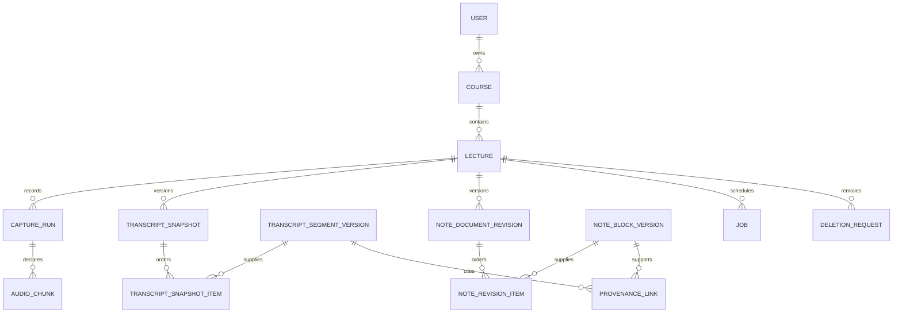

# Phase 3: Data model and transaction boundaries

This is a logical schema, not an applied migration. It supports the [architecture](phase-3-architecture.md) and [API/event contracts](phase-3-api-events.md). UUID-like opaque IDs identify entities; integer revisions and sequence counters express order. Timestamps are UTC for audit, with sample coordinates authoritative within each capture run.

## Entity relationships

## Core records and constraints

| Record | Essential fields | Constraints and purpose |
| --- | --- | --- |
| users / sessions | owner ID; hashed session token; expiry; revoked time | A local owner still requires authenticated requests. Bootstrap tokens are single-use and stored hashed. |
| courses | ID; owner ID; name; default settings version | Ownership checked on all derived access. |
| lectures | ID; course/owner; title; lifecycle state/epoch; audio epoch; capture epoch/owner; latest pointers; update sequence | Every content-producing transaction locks/rechecks this row. Tombstones retain only opaque identity/state needed to reject replay. |
| settings_versions | ID; lecture or course; version; depth; format; explanation flag; provider-role configuration | Immutable snapshots; store provider references, not secret values. |
| capture_runs | ID; lecture; owner token hash; capture epoch; sample rate/channels; timeline origin; heartbeat; sealed flag; last sequence; final sample count | One current authorized capture run per lecture. Immutable sealed manifest versions preserve later reconciliation. |
| capture_gaps | ID; lecture/run; known start/end or unknown extent; reason; acknowledgement revision | Missing time is not generated audio. Unknown extents must not acquire invented exact timestamps. |
| upload_reservations | ID; lecture/run/sequence; object key; lifecycle/audio/capture epochs; in-flight status | Reserve before object writes; deletion/reconciliation inventory includes reservations, including failed writes. |
| audio_chunks | ID; lecture/run; sequence; start sample; sample count; checksum; size; format; object key; storage state | Unique `(run_id, sequence)`; duplicate identity must match all immutable metadata. Positive counts, supported format, and verified checksum required before acknowledgement. |
| audio_manifest_revisions / manifest_items | manifest ID/version; lecture; run seals; exact chunk IDs; gaps; completeness | Snapshot membership is immutable. Sealed last sequence bounds late chunks; conflicts need explicit recovery, not silent extension. |
| transcript_segment_versions | version ID; logical segment ID; revision; text; author; stability; run/sample spans; superseded IDs; generation ID | Immutable source text. A split/merge creates new segment IDs and explicit supersession mappings; do not retarget old citations. |
| transcript_snapshots / transcript_snapshot_items | snapshot ID; manifest revision; ordered segment-version IDs; failed/unprocessed ranges | Unique positions within a snapshot. Final status requires terminal processing decisions, not just the last timestamp. |
| topic_versions | ID; lecture; transcript snapshot; ordered segment membership; title; state | Derived organization; changing a topic boundary does not change source identity. |
| note_blocks / note_block_versions | stable block ID; version ID; structured passages; author kind; human-protected flag; prior version; generation ID | Version content immutable; no model replacement of human-protected content without explicit resolution. |
| note_document_revisions / note_revision_items | document revision; lecture; transcript/settings/manifest snapshots; ordered block-version IDs; completeness/issues | Unique positions; published revision references exactly the blocks displayed/exported. Overview is a separate artifact linked to its detailed revision. |
| provenance_links | block version; passage ID; segment-version ID; character start/end; evidence kind; sample interval | Offsets refer to immutable text. Source version must belong to the authorized lecture and selected source inputs; a link's existence does not establish semantic support. |
| dependency_invalidations | artifact/version; changed source/settings; reason; status | Persist Source changed status, including dependencies of overviews. Keep the old revision readable. |
| edit_proposals | ID; base document/block/source/settings versions; lifecycle epoch; proposed blocks; status | Accept only if all bases still match. Keep mine/merge/replace creates a versioned resolution record. |
| generation_runs | ID; job attempt; role/model; source/settings snapshots; prompt/schema versions; start/end; outcome | Auditable inputs and output references. Provider secrets and unnecessary duplicate prompts are excluded. |
| jobs | ID; logical key; lecture/lifecycle/audio epochs; input revisions; type; priority; status; due time; attempt token; lease expiry; error code | Unique logical key includes role, input snapshot, settings and schema versions. Each claim changes the attempt token; stale claims cannot publish. |
| outbox_events | event ID; event type/version; lecture/epoch; job/entity reference; published time | Created in the same transaction as work/state. Contains no lecture content. Repeated publication is allowed. |
| inbox_events | consumer name; event ID; processed time; effect reference | Unique `(consumer_name, event_id)`, not a global event-only key. Record together with the durable consumer effect. |
| command_receipts | owner; route/action; idempotency key; request fingerprint; result reference | Same key and payload returns the prior result; different payload returns conflict. Never replay cached content after access revocation or deletion. |
| lecture_updates | lecture ID; sequence; entity/version reference; event kind | Unique `(lecture_id, sequence)` allocated under lecture lock. Used for ordered UI replay, not as the canonical content store. |
| deletion_requests / deletion_items | request ID; scope; epochs; object/local/backup categories; completion/failure state | Track active-store deletion separately from unconfirmed browser copies and user-managed backups. |

Related rows carry lecture/owner keys or constrained parent relationships. Use foreign keys and composite ownership relationships where possible; do not allow a provenance row or snapshot item to cross lecture boundaries merely because an ID exists.

## Concurrency and transaction rules

Use short transactions with a consistent lock order: lecture, affected artifact/job, then child rows. Lock the lecture row before checking deletion epochs and writing content. Model calls and object transfers occur outside transactions. Retry transaction deadlocks with a bounded policy.

| Operation | Atomic database work | External work and recovery |
| --- | --- | --- |
| Reserve audio upload | Check owner/run/epoch; insert or find immutable reservation. | Upload/write/readback outside lock; recheck before committing a chunk. |
| Acknowledge chunk | Mark verified chunk; create logical job, outbox, and lecture update; advance contiguous coverage if appropriate. | A lost response is retried by identity. Broker downtime does not roll back a verified save. |
| Seal run | Compare expected manifest version; record last sequence, final sample count, and explicit gaps. | Missing declared data remains pending; do not finalize automatically from a timer. |
| Claim job | Confirm live lecture and input validity; set running status, new attempt token, and lease expiry. | Inference executes outside lock; reclaim expired attempts safely. |
| Commit worker result | Check current lifecycle/audio epochs where applicable, current attempt token, and source/settings bases; insert versions, dependencies, jobs/outbox, updates. | Stale output is discarded or stored as a nonpublished proposal when permitted; it never advances visible pointers blindly. |
| Save student edit | Compare expected block/document version; insert new human-authored revision; protect edited blocks; publish update. | Keep unsaved browser draft on conflict or failure. |
| Apply proposal | Compare every proposal base; append chosen version and resolution; update visible pointers. | No automatic last-writer-wins merge. |
| Delete lecture | Set tombstone/lifecycle epoch; revoke owner; cancel jobs and publication eligibility; record deletion inventory. | Remove objects and browser journals, reconcile reservations, then mark each scope completed. |
| Export | Authorized consistent read of note revision, pinned source excerpts, and issue state. | Stream rendered Markdown; check deletion before sending and abort on revocation. Bytes already downloaded cannot be recalled. |

Only a current job attempt can mark itself completed. Explicit retry must not reset a completed result into a state that appends duplicate note blocks. A new model/settings/input version produces a new logical job, not mutation of the previous one.

## Browser journal

IndexedDB stores capture-run grants, chunk blobs and immutable metadata, local run seals/gaps, acknowledgement receipts, and edit drafts with their expected server revisions. Use one transaction to associate each blob and its manifest entry; treat a request-success callback as insufficient until the transaction completes.

On reopening, verify the account/lecture state before upload or draft replay. The journal is owner-scoped; signing out removes accessible UI content, while deletion requires a purge. If the server denies access or reports deletion, purge associated local content without sending it to a different account.

## Initial indexes and retention

- Unique run/sequence, note/block version identity, document item position, logical job key, inbox consumer/event, and lecture update sequence.
- Jobs indexed by status/due time and running lease expiry; outbox by unpublished creation time; updates by lecture/sequence; reservations by lecture/state.
- Sources indexed by lecture/run/sample interval; provenance by source version and target block version; invalidations by affected artifact/status.
- Start with no vector index and no full-text search requirement. Do not add a second database for a future feature.
- Retain source/note versions until explicit lecture deletion. Proposed metadata-only broker/update history: seven days, configurable. Expired UI cursors cause snapshot reset. Job ledger recovery must not depend on broker retention.
- Keep command deduplication receipts for active work and referenced finalized revisions; garbage collection cannot re-enable an old creation command against a tombstoned lecture.

## Migration and restore requirements

Phase 5 will turn this logical schema into ordered migrations with constraints and rollback/recovery notes. Test fresh setup, incremental upgrade, duplicate constraints, cross-lecture reference rejection, concurrent edit/delete, and restoration of database plus referenced objects. No SQL migration or live schema validation has run in this phase.
